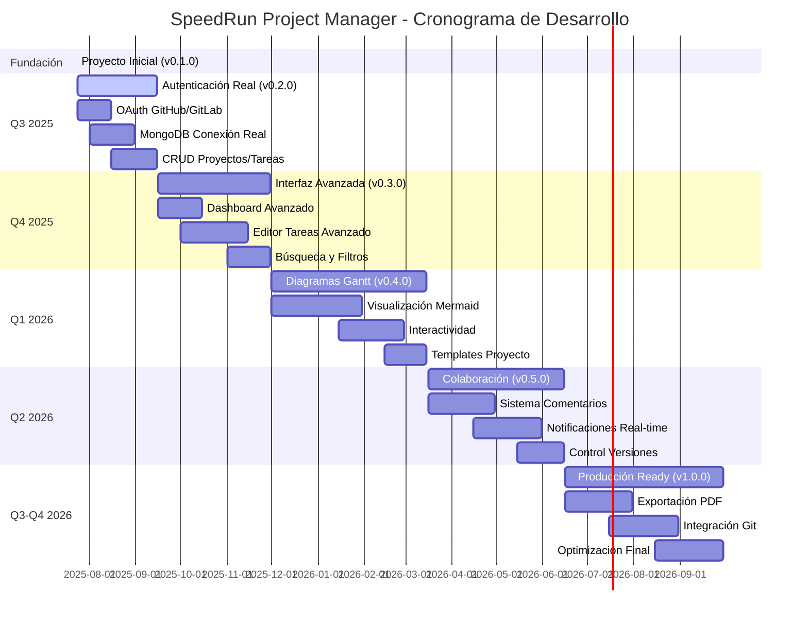

# SpeedRun Project Manager - Roadmap

Este documento describe la hoja de ruta para el desarrollo del **SpeedRun Project Manager**, un gestor de proyectos avanzado con diagramas Gantt y soporte para Markdown.

## 📊 Cronograma Visual del Proyecto

## 📋 Estado Actual: v0.1.0 (Julio 2025)

### ✅ Funcionalidades Completadas
- Configuración base con Next.js 14 + Express
- Autenticación mock funcional con JWT
- Dashboard básico con información de usuario
- Modelos de datos MongoDB (Usuario, Proyecto, Tarea)
- API REST mock completa
- Sistema de componentes Tailwind CSS
- Docker setup para desarrollo
- Documentación completa

---

## 🚀 Version 0.2.0 - "Autenticación Real" (Q3 2025)

### 🎯 Objetivo Principal
Implementar autenticación completa y gestión básica de proyectos con base de datos real.

### 📦 Funcionalidades Principales

#### 🔐 Sistema de Autenticación
- [ ] **OAuth con GitHub**
  - Configuración completa de Passport.js GitHub
  - Flujo de autorización y callback
  - Integración con perfil de usuario GitHub
  
- [ ] **OAuth con GitLab**
  - Configuración de Passport.js GitLab
  - Soporte para GitLab.com e instancias self-hosted
  - Sincronización de datos de perfil

- [ ] **Middleware de Autenticación**
  - Guards para rutas protegidas
  - Renovación automática de tokens
  - Logout seguro y limpieza de sesiones

#### 💾 Base de Datos Real
- [ ] **Conexión MongoDB**
  - Migración de datos mock a MongoDB
  - Configuración de conexiones ambiente dev/prod
  - Índices de base de datos optimizados

- [ ] **Gestión de Usuarios**
  - CRUD completo de perfiles de usuario
  - Asociación con cuentas GitHub/GitLab
  - Configuraciones de usuario personalizables

#### 📊 Gestión Básica de Proyectos
- [ ] **CRUD de Proyectos**
  - Crear, leer, actualizar y eliminar proyectos
  - Asignación de miembros del equipo
  - Estados de proyecto (activo, pausado, completado)

- [ ] **Gestión de Tareas**
  - CRUD completo de tareas
  - Asignación de responsables
  - Estados de tarea (pendiente, en progreso, completada)

### 🔧 Mejoras Técnicas
- [ ] Validación de datos con Joi/Zod
- [ ] Tests unitarios básicos (Jest)
- [ ] Manejo de errores mejorado
- [ ] Logging estructurado

### 📅 Estimación: 4-6 semanas

---

## 🎨 Version 0.3.0 - "Interfaz Avanzada" (Q4 2025)

### 🎯 Objetivo Principal
Mejorar significativamente la experiencia de usuario con interfaces avanzadas y funcionalidades colaborativas.

### 📦 Funcionalidades Principales

#### 🎪 Dashboard Avanzado
- [ ] **Vista General Mejorada**
  - Gráficos de progreso de proyectos
  - Estadísticas de productividad
  - Feed de actividad reciente

- [ ] **Widgets Personalizables**
  - Dashboard modular y reorganizable
  - Métricas customizables por usuario
  - Atajos rápidos a acciones frecuentes

#### 📝 Editor de Tareas Avanzado
- [ ] **Dependencias de Tareas**
  - Sistema completo de dependencias
  - Validación de ciclos dependencia
  - Vista gráfica de dependencias

- [ ] **Subtareas y Jerarquías**
  - Tareas anidadas múltiples niveles
  - Cálculo automático de progreso
  - Vista de árbol expandible

- [ ] **Campos Personalizados**
  - Prioridades configurables
  - Etiquetas y categorías
  - Campos custom por proyecto

#### 🔍 Búsqueda y Filtros
- [ ] **Búsqueda Avanzada**
  - Búsqueda full-text en tareas/proyectos
  - Filtros múltiples combinables
  - Búsqueda por fechas y estados

- [ ] **Vistas Personalizadas**
  - Guardado de filtros personalizados
  - Vistas por usuario y compartidas
  - Ordenamiento flexible

### 📅 Estimación: 6-8 semanas

---

## 📊 Version 0.4.0 - "Diagramas Gantt" (Q1 2026)

### 🎯 Objetivo Principal
Implementar la funcionalidad principal de diagramas Gantt interactivos con Mermaid.

### 📦 Funcionalidades Principales

#### 📈 Diagramas Gantt Interactivos
- [ ] **Visualización con Mermaid**
  - Generación automática de diagramas Gantt
  - Integración fluida con datos de tareas
  - Personalización de estilos y colores

- [ ] **Interactividad**
  - Zoom y navegación en timeline
  - Edición drag-and-drop de fechas
  - Tooltips con información detallada

- [ ] **Planificación de Cronograma**
  - Cálculo automático de fechas críticas
  - Detección de conflictos de recursos
  - Simulación de escenarios "what-if"

#### 📋 Gestión de Cronogramas
- [ ] **Templates de Proyecto**
  - Plantillas predefinidas por industria
  - Creación de templates personalizados
  - Importación/exportación de templates

- [ ] **Milestone Management**
  - Creación y tracking de hitos
  - Alertas de fechas críticas
  - Reportes de cumplimiento

### 📅 Estimación: 8-10 semanas

---

## 💬 Version 0.5.0 - "Colaboración" (Q2 2026)

### 🎯 Objetivo Principal
Implementar funcionalidades colaborativas avanzadas y comunicación en tiempo real.

### 📦 Funcionalidades Principales

#### 💭 Sistema de Comentarios
- [ ] **Comentarios en Tareas**
  - Hilos de conversación anidados
  - Menciones de usuarios (@usuario)
  - Formato Markdown en comentarios

- [ ] **Notificaciones**
  - Sistema de notificaciones en tiempo real
  - Configuración personalizable de alertas
  - Integración con email y webhooks

#### 🔄 Colaboración en Tiempo Real
- [ ] **Actualizaciones Live**
  - WebSockets para cambios en tiempo real
  - Indicadores de usuarios conectados
  - Sincronización automática de estado

- [ ] **Control de Versiones**
  - Historial de cambios en tareas/proyectos
  - Rollback a versiones anteriores
  - Audit log completo

### 📅 Estimación: 6-8 semanas

---

## 🚀 Version 1.0.0 - "Producción Ready" (Q3-Q4 2026)

### 🎯 Objetivo Principal
Lanzamiento oficial con funcionalidades completas, optimización y estabilidad de producción.

### 📦 Funcionalidades Principales

#### 📄 Exportación y Reportes
- [ ] **Exportación PDF**
  - Reportes de proyecto profesionales
  - Diagramas Gantt en alta calidad
  - Templates de reporte personalizables

- [ ] **Integración Git**
  - Sincronización con repositorios
  - Tracking de commits por tarea
  - Enlaces automáticos PR/issues

#### 🔧 Optimización y Rendimiento
- [ ] **Optimizaciones Frontend**
  - Code splitting avanzado
  - Lazy loading de componentes
  - PWA con service workers

- [ ] **Optimizaciones Backend**
  - Caching con Redis
  - Optimización de queries MongoDB
  - Rate limiting y throttling

#### 🛡️ Seguridad y Compliance
- [ ] **Seguridad Avanzada**
  - Audit de seguridad completo
  - Implementación de CSP headers
  - Validación y sanitización estricta

- [ ] **Testing Completo**
  - Cobertura de tests > 90%
  - Tests de integración E2E
  - Performance testing

### 📅 Estimación: 10-12 semanas

---

## 🔮 Futuro (2026+)

### 🌟 Funcionalidades Avanzadas

#### 📱 Aplicación Móvil
- [ ] **React Native App**
  - Aplicación nativa iOS/Android
  - Sincronización offline-first
  - Notificaciones push

#### 🤖 IA y Automatización
- [ ] **Asistente IA**
  - Sugerencias inteligentes de tareas
  - Estimación automática de tiempos
  - Detección de riesgos de proyecto

#### 🔗 Integraciones Empresariales
- [ ] **APIs Corporativas**
  - Integración con Jira/Confluence
  - Conectores Slack/Microsoft Teams
  - Sincronización con calendarios

#### ☁️ Infraestructura Escalable
- [ ] **Multi-tenant SaaS**
  - Arquitectura multi-inquilino
  - Planes de suscripción
  - Dashboard de administración

---

## 📊 Métricas de Éxito

### Key Performance Indicators (KPIs)

#### Técnicos
- **Performance**: < 2s tiempo de carga inicial
- **Disponibilidad**: > 99.5% uptime
- **Cobertura Tests**: > 90%
- **Vulnerabilidades**: Cero críticas/altas

#### Producto
- **Adopción**: > 1000 usuarios registrados (v1.0)
- **Retención**: > 60% usuarios activos mensualmente
- **Satisfacción**: > 4.5/5 rating promedio
- **Time-to-Value**: < 5 minutos setup inicial

---

## 🤝 Contribución y Desarrollo

### 🛠️ Proceso de Desarrollo
1. **Planning**: Issues detallados con acceptance criteria
2. **Development**: Feature branches con PR reviews
3. **Testing**: Automated testing + manual QA
4. **Deployment**: Staging → Production pipeline
5. **Monitoring**: Performance y error tracking

### 📋 Criterios de Release
- [ ] Todas las funcionalidades principales implementadas
- [ ] Tests passing al 100%
- [ ] Documentación actualizada
- [ ] Performance benchmarks cumplidos
- [ ] Security audit completado

---

## 📞 Contacto y Feedback

**Mantenedor Principal**: Rodrigo Álvarez (@incognia)
- **GitHub**: [@incognia](https://github.com/incognia)
- **Email**: incognia@gmail.com

**Para sugerencias y feedback**:
- Abrir issue en GitHub
- Participar en discussions del repositorio
- Contribuir con PRs siguiendo las guías de contribución

---

*Última actualización: Julio 2025*  
*Próxima revisión: Octubre 2025*
